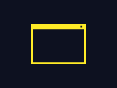
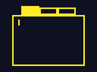
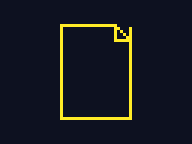
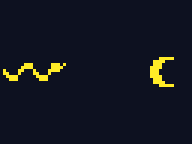
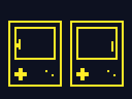
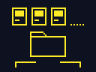
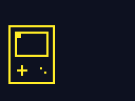

# moybyte

[](https://github.com/moybyte-org/moybyte/actions/workflows/ci.yml)

**A small operating system for ESP32 boards. Its software is cartridges — games,
wallpapers and tools — and you can open, change and run any of them on the board
itself, with no computer attached.** The same source tree also runs as a PC
simulator and in a browser.

It is in the family of TIC-80 and Picotron, a fantasy console with its editors
built in, except that the launcher, the editor and the running cart are all
ordinary processes under one window manager. A cart is a folder: a manifest, a
Python or Lua script, a sprite sheet, a tilemap and a sound bank. There is no
build step.

The block editor and the built-in carts are aimed at kids. Underneath is a
MicroPython firmware with C drawing and audio kernels, a Lua VM, over-the-air
updates and a windowing shell, and all of it is open to read and change.

Carts draw in 64 indexed colours on a 320×240 screen on every target. The shell
around them adapts to the screen, from a 320×240 handheld to a 10″ desktop.

This repo is the reference implementation of
[moy core 0.3](https://github.com/moybyte-org/moy-spec), the public spec for the
cart format and its verbs.

<p align="center">
  
  <br><em>Paint on the sprite, and the game running beside the editor picks it up.</em>
</p>

|  |  |
|:--:|:--:|
| The code editor | Blocks compile to the same Python |

## What it runs on

| target | |
|---|---|
| **LilyGO T-Deck Plus** (ESP32-S3) | 320×240 handheld with keyboard, trackball and touch |
| **Waveshare ESP32-P4 7B** | 7″ 1024×600 touch screen, windowed desktop |
| **Guition JC8012P4A1C** (ESP32-P4) | 10.1″ 1280×800 touch screen, the same desktop as the Waveshare |
| **Guition JC3248W535** (ESP32-S3) | 3.5″ 480×320 touch screen |
| **Seeed XIAO ESP32-S3** | no screen: it stores carts and serves the browser console over WiFi |
| **PC simulator** | `tools/simulate_desktop.py`, running the same `runtime/` modules as the boards |
| **Browser** | MicroPython compiled to WebAssembly (`firmware/web_runner/`) |

Host and device are one codebase. Each firmware build freezes copies of the
`runtime/` modules, so the simulator runs the same code as the boards.

|  |  |
|:--:|:--:|
| Paint on the 320×240 handheld | The code editor on the 320×240 handheld |

## What's in it

Tap a tile to read about it.

<table>
<tr>
<td width="33%" valign="top"><details><summary><br><b>Windows and processes</b></summary>The launcher, the editor and your game are all processes under one window manager: fullscreen on a handheld, overlapping windows on a desktop board.</details></td>
<td width="33%" valign="top"><details><summary><br><b>Editors on the device</b></summary>Code, blocks, sprites, maps, scenes and music, on the board itself. Autosave with undo, and a crash opens the code at the failing line.</details></td>
<td width="33%" valign="top"><details><summary><br><b>Apps</b></summary>Paint, Files, Notes, Storybook, Calc and Settings. Drawings and documents go into a shared store that carts can read. Your own apps can be carts too (<a href="docs/app_api_v1.md">app API</a>).</details></td>
</tr>
<tr>
<td width="33%" valign="top"><details><summary><br><b>Python and Lua</b></summary>Write carts in either language. The verbs are the same in both, so a cart ports line by line. See <a href="docs/moy_cart_api.md">the verb table</a>.</details></td>
<td width="33%" valign="top"><details><summary><br><b>Local multiplayer</b></summary>Two consoles in the same room find each other over ESP-NOW and play one game on two screens. No router, no cables.</details></td>
<td width="33%" valign="top"><details><summary><br><b>PICO-8 import</b></summary>Drop a <code>.p8</code> or <code>.p8.png</code> cart on the browser console and it becomes a Lua cart — art, map, sound and code — that opens in the editors.</details></td>
</tr>
<tr>
<td width="33%" valign="top"><details><summary><br><b>Carts are folders</b></summary>A manifest, a script, sprites, a map and sounds. There is no build step: a folder in the cart store is a cart on the launcher.</details></td>
<td width="33%" valign="top"><details><summary><br><b>Updates</b></summary>Signed over-the-air updates on a stable and a beta channel. If a new image doesn’t boot, the board goes back to the one before.</details></td>
<td width="33%" valign="top"><details><summary><br><b>In the browser</b></summary>The same console runs in a tab and keeps your carts there. A board can also serve it over WiFi, so a phone or laptop edits that board’s carts.</details></td>
</tr>
</table>

## Try it

```bash
make setup                                       # venv + editable install (dev, sim)
make test                                        # pytest
.venv/bin/python tools/simulate_desktop.py       # boots the launcher
```

You need Python 3.10+ and a C compiler (`cc` or `gcc` on PATH, or `$CC`): the
simulator draws, plays audio and runs Lua through the same C library as the
boards. Debian/Ubuntu `sudo apt install build-essential`, Fedora
`sudo dnf install gcc`, macOS `xcode-select --install`.

Arrows or WASD move, Z or Space is A, X is B, Enter runs, hold H or Backspace to
go home, Esc quits. The mouse is the touchscreen. Pick **Make** on the launcher
to open the editor on any cart.

```bash
# the 1024x600 desktop
.venv/bin/python tools/simulate_desktop.py --size 1024x600 --windowed

# run one cart
.venv/bin/python tools/simulate_desktop.py --cart system_carts/star_catcher.moy

# a headless tour, recorded to a GIF (how the GIFs above are made)
.venv/bin/python tools/simulate_desktop.py --demo --gif demo.gif

# the browser build (downloads emsdk on its first run)
cd firmware/web_runner && ./build.sh && python serve.py
```

`--cart` copies a cart from outside the cart store (`~/.moybyte/projects/`) the
first time and runs that copy afterwards, so later edits to the original don't
show up. Keep a cart you are working on inside the store.

**On Windows** the Makefile doesn't work, so set up by hand and use
`.venv\Scripts\python` wherever this README says `.venv/bin/python`:

```bat
py -3 -m venv .venv
.venv\Scripts\python -m pip install --upgrade pip setuptools
.venv\Scripts\python -m pip install -e ".[dev,sim]"
```

## Write a cart

A cart is a folder (`manifest.json` + `main.py` + `config.json`, plus optional
sprites, tilemap and sounds). There are no imports; the verbs are globals:

```python
# a tiny cart: move a ball with the D-pad
x = y = 0

def _init():
    global x, y
    x, y = W // 2, H // 2

def _update(dt):                 # dt in seconds
    global x, y
    speed = 120 * dt
    if btn("left"):  x -= speed
    if btn("right"): x += speed

def _draw():
    cls(col("dark_blue"))
    circ(int(x), int(y), 6, col("yellow"))
    print("MOVE ME", 8, 8, col("white"))
```

For Lua, set `"runtime": "lua"` in the manifest and write `main.lua`.
`system_carts/sakura_lua.moy` is a Lua copy of `system_carts/sakura.moy`, and a
test checks that they draw the same pixels.

- [`docs/moy_cart_api.md`](docs/moy_cart_api.md) — the verb table.
- `system_carts/` — the 30 built-in carts, from a 70-line tap game to Brick Siege.
- [`docs/blocks_tap_game.md`](docs/blocks_tap_game.md) — building
  `system_carts/tap_game.moy` in the block editor, step by step.

## The spec

The cart format and verbs are a public spec,
[moybyte-org/moy-spec](https://github.com/moybyte-org/moy-spec) (MIT), so carts
don't depend on this implementation. It has `SPEC.md`, its own browser player, a
`moy` command-line tool (`new`, `run`, `export`, `port`, …) and a PICO-8
converter. The spec covers what a game uses; the shell, editors, window manager
and app API in this repo are outside it.

## Flash a board

Without a toolchain, the [project site](https://moybyte-org.github.io/moybyte/)
flashes a board from Chrome or Edge over Web Serial, using the images from the
[`firmware-latest`](https://github.com/moybyte-org/moybyte/releases/tag/firmware-latest)
release.

From source, each board's `build.sh` downloads the MicroPython and ESP-IDF it
needs into `.build/`, so the first build is slow:

```bash
make firmware-build-tdeck-mainline && make firmware-flash-tdeck-mainline PORT=/dev/ttyACM0
make firmware-build-p4             && make firmware-flash-p4             PORT=/dev/ttyACM0
make firmware-build-guition-s3     && make firmware-flash-guition-s3     PORT=/dev/ttyACM0
make firmware-build-guition-p4     && make firmware-flash-guition-p4     PORT=/dev/ttyACM0
make firmware-build-zero           && make firmware-flash-zero           PORT=/dev/ttyACM0
```

`master` is the tested branch: its builds go to `firmware-latest` and the stable
update channel. Work happens on `dev`, whose builds go to
[`firmware-beta`](https://github.com/moybyte-org/moybyte/releases/tag/firmware-beta)
and to boards that pick the beta channel in Settings → CHANNEL.

Each `firmware/<board>/` directory has a README with that board's hardware
constraints. Read it before changing the board.

## Where things live

| path | |
|---|---|
| `runtime/` | the system: kernel, window managers, Player, Editor. [Its README](runtime/README.md) maps every file. |
| `system_carts/` | the built-in carts |
| `firmware/<board>/` | one directory per board, plus `firmware/web_runner/` for the browser build |
| `native/` | the C modules the boards build in; `native/p4/` is shared by both ESP32-P4 boards |
| `tools/` | simulator, GIF recorder, PICO-8 import, on-device test drivers |
| `docs/` | cart API, shell UX, architecture and design docs |
| `CLAUDE.md` | the most complete map of the repo. It is written for AI tools, but it is a good first read for people too. |

## Contributing

Read [`CONTRIBUTING.md`](CONTRIBUTING.md): open an issue before starting a
feature, and sign off every commit (`git commit -s`).

The rule that catches people: host and device share one canvas class,
`device_canvas.DeviceCanvas`, which the host runs through
`runtime/host_canvas.py`. A drawing change goes there, or carts stop behaving
the same on every target.

## License

You can run it, flash your own boards, modify it, teach with it, and make and
sell your own carts. Selling hardware or a commercial product built on Moybyte
needs a commercial license, and each release becomes MIT two years after it is
published. The system is [FSL-1.1-MIT](LICENSES/FSL-1.1-MIT.md); the cart format
and API are an open spec, and carts you make are yours. Details in
[`LICENSE.md`](LICENSE.md) and [`docs/licensing_v1.md`](docs/licensing_v1.md).

---

*The page for kids and parents is [moybyte.com](https://moybyte.com). Most of
the code here was written with Claude Code, directed and tested on hardware by a
human.*
