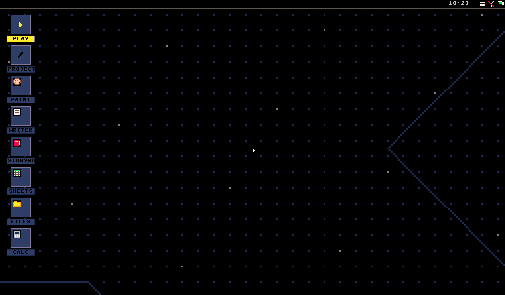
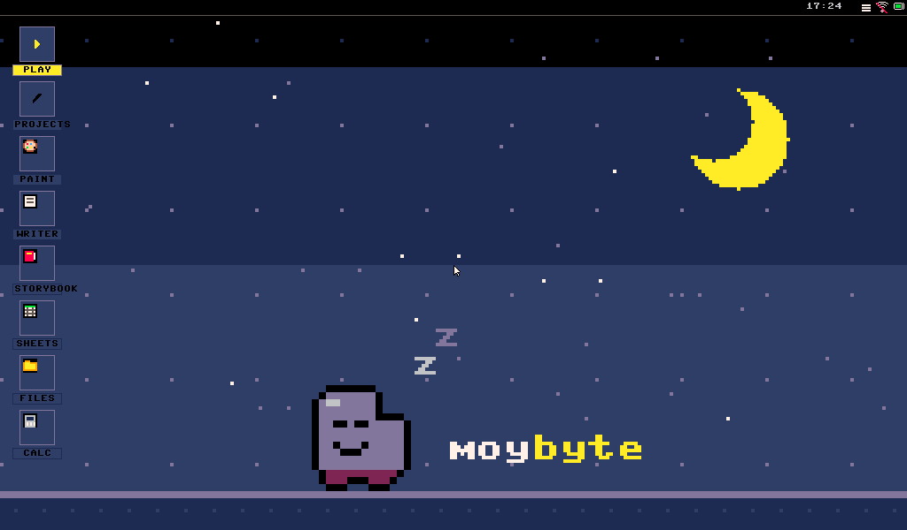
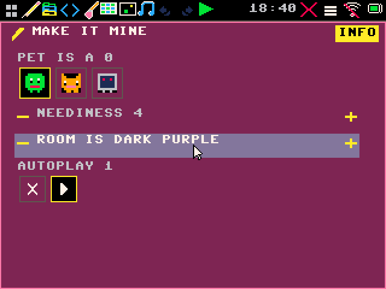
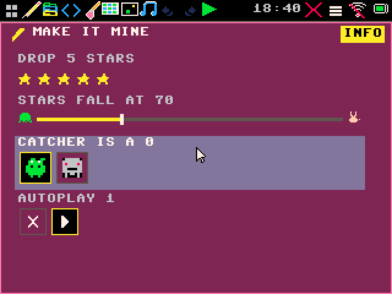

# moybyte

[](https://github.com/moybyte-org/moybyte/actions/workflows/ci.yml)

**A fantasy workstation where everything is a cartridge — the games, the paint
app, the wallpaper, the spreadsheet. Open any of them, change it, run it. The
same console runs as a PC simulator, on two real ESP32 boards, and in a browser
tab, drawing the same 320×240 indexed pixels on all four.**

Think TIC-80, but the console is the *operating system*: a launcher, a windowing
shell, and an editor (code / sprites / tilemap / scene / music / blocks) that are
themselves ordinary processes over one small cart API. A cart is a folder — a
manifest, a Python or Lua script, an indexed sprite sheet, a tilemap, a sound
bank. No build step, no per-device binary.

This repo is the **reference implementation of [moy core 0.1](https://github.com/moybyte-org/moy-spec)**,
the public spec for that cart format and its verb table.

<p align="center">
  
  <br><em>Paint a smile on the sprite — the game window beside it is already wearing it.</em>
</p>

|  |  |
|:--:|:--:|
| The code editor is a tab in the same console | Blocks compile to the same Python, and *graduate* to it |

## What it runs on

| target | what it is |
|---|---|
| **PC simulator** | `runtime/` — pure Python, no device. The host reference and the fast dev loop. |
| **LilyGO T-Deck Plus** (ESP32-S3) | MicroPython firmware, native 320×240, keyboard + trackball + touch, carts on SD, OTA updates. |
| **Waveshare ESP32-P4 7B** | 1024×600 MIPI-DSI. Same console, second presentation tier: a windowed desktop with draggable app windows. |
| **Browser** | MicroPython compiled to WebAssembly (`firmware/web_runner/`) — the console *is* the page, no server. |

Host and device are **one codebase**, not a port. `runtime/` is canonical; each
firmware build stages copies of those modules and freezes them. A pixel that
moves in the simulator moves on glass.

The GIFs above are the desktop tier at 1024×600. Here is the *same console, same
code*, on the handheld tier at its native 320×240 — the layouts reflow, the
pixels don't change:

|  |  |
|:--:|:--:|
| The same paint session, fullscreen at 320×240 | …and the same code editor |

Only a *running cart* is fixed at 320×240. Every editor surface is
system-domain responsive, so the console reflows to a phone-sized panel, a
handheld, or a 7″ desktop from one implementation.

## Try it in 60 seconds

```bash
make setup                                       # venv + editable install (dev + sim)
make test                                        # pytest
.venv/bin/python tools/simulate_desktop.py       # boots the launcher
```

Arrows move, `Enter` runs, `M` menu, `H` home, `Esc` quits; the mouse is the
touchscreen. Tap **Make ✏️** to open the editor on any cart, including the ones
you just played.

```bash
# the P4's windowed desktop tier, on your PC
.venv/bin/python tools/simulate_desktop.py --size 1024x600 --windowed

# skip the launcher, run one cart
.venv/bin/python tools/simulate_desktop.py --cart system_carts/star_catcher.moy

# the whole console streamed to a browser as draw commands (no wasm build)
.venv/bin/python tools/web_console.py --size 1024x600 --windowed

# headless tour -> animated GIF (this is how the GIFs above are made)
.venv/bin/python tools/simulate_desktop.py --demo --gif demo.gif
```

No display? Every test runs headless, and `--gif`/`--script` drive the real
console without one.

**In the browser, for real.** `firmware/web_runner/build.sh` compiles the same
console to WebAssembly (it fetches emsdk itself; first build is slow) and emits a
static `dist/` — serve it with `firmware/web_runner/serve.py` and the whole
console, cart roster included, runs in a tab with no server behind it. That build
is also what the spec repo vendors as its player, so **you can try a cart without
cloning anything**: `moy.py run` over there is one command and no dependencies.

## Write a cart

A cart is a folder (`manifest.json` + `main.py` + `config.json`, plus optional
sprites / tilemap / sounds). Three optional lifecycle hooks, and **no imports** —
the verbs are pre-injected globals:

```python
# a tiny cart: move a ball with the D-pad
x = y = 0

def _init():
    global x, y
    x, y = W // 2, H // 2

def _update(dt):                 # dt in seconds
    global x, y
    speed = 120 * dt
    if btn("left"):  x -= speed
    if btn("right"): x += speed

def _draw():
    cls(col("dark_blue"))
    circ(int(x), int(y), 6, col("yellow"))
    print("MOVE ME", 8, 8, col("white"))
```

The same cart in **Lua** is one manifest line away (`"runtime": "lua"` +
`main.lua`) — every verb in the API is valid verbatim in both languages, and on
device Lua carts run on a vendored Lua 5.4 VM with the cart heap outside
MicroPython's GC. `system_carts/sakura_lua.moy` is a line-by-line, pixel-identical
twin of `system_carts/sakura.moy`, pinned by a test.

- **[`docs/moy_cart_api.md`](docs/moy_cart_api.md)** — the full verb table:
  drawing, input, sprites, tilemaps, layers, audio, scenes, persistent memory.
- **`system_carts/*/`** — 30-odd real carts, from a 70-line tap game to Battle
  City. They are the worked examples, and they model the "draw less" idioms the
  docs teach.

## The spec

The cart format and verb table are a **public spec** so carts aren't hostage to
this console: [**moybyte-org/moy-spec**](https://github.com/moybyte-org/moy-spec)
(MIT). It ships `SPEC.md`, a browser player built from this repo's web runner,
a `moy` CLI (`new` / `run` / `export` / `port`), and a PICO-8 converter — a p8
cart converts art, map, sound and code under a compat shim.

The spec is deliberately narrow: it describes what a *game* touches. Everything
else in this repo — the shell, the editors, the window manager, the app API — is
above core, and consoles are expected to differ there.

## The hardware, honestly

Both boards are real and both boot to the console — but both are off-the-shelf
dev boards; bespoke hardware is roadmap, not shipped. The T-Deck Plus is a
keyboard handheld; the P4 board is a 7″ desktop. What's honest about the state:

- **It plays.** The seed carts run at playable frame rates on both boards, with
  the whole editor suite usable on the device itself.
- **Performance is tracked in the open, not claimed.** Per-cart fps, the frame
  budget model, and every lever *including the ones that were built, measured
  and reverted* live in [issue #66](https://github.com/moybyte-org/moybyte/issues/66)
  (T-Deck) and [#58](https://github.com/moybyte-org/moybyte/issues/58) (P4);
  [`docs/perf_native_gap_v1.md`](docs/perf_native_gap_v1.md) is the strategic
  analysis of why we trail native emulators and what's left.
- **Open holes are filed, not hidden** — USB-HID keyboard and audio on the P4,
  the touch-controller stalls, the editor-tab draw cost. See the issue tracker.

Build and flash:

```bash
MOYBYTE_SKIP_VFS_BOOT=1 make firmware-build-lilygo-micropython   # needs ESP-IDF 5.5
make firmware-flash-lilygo-micropython PORT=/dev/ttyACM0
make firmware-build-p4 && make firmware-flash-p4 PORT=/dev/ttyACM0
```

Each firmware directory has its own README recording the hardware-learned
constraints (shared SPI bus rules, DSI/PSRAM timing, the keyboard's two modes) —
**read them before touching that board.** They exist because each line in them
cost a debugging session.

## Where things live

| path | |
|---|---|
| `runtime/` | the console: kernel, WMs, player, editor app, every surface. **[Its README](runtime/README.md) is a per-file map.** |
| `system_carts/` | the seed cartridges — games, wallpapers, and the system apps (Paint, Files, Sheets, Writer, Storybook, Calc) |
| `firmware/lilygo_t_deck_plus_micropython/` | the ESP32-S3 port + the native C modules (`moy_gfx`, `moy_lua`, `moy_audio`, `moy_sd`) |
| `firmware/esp32_p4_wifi6_touch_lcd_7b/` | the ESP32-P4 port (mainline MicroPython + a vendored DSI driver) |
| `firmware/web_runner/` | the MicroPython-WASM build; `build.sh` fetches emsdk itself |
| `tools/` | simulator, web console, GIF recorder, p8 importers, on-glass test drivers |
| `docs/` | cart API, shell UX, visual identity, architecture and design docs |
| **`CLAUDE.md`** | **the best single map of this repo.** Written for AI tools, but it is the orientation doc humans should read first. |

Design doc: [`moybyte_Console_Plan_v0_5.md`](moybyte_Console_Plan_v0_5.md).
Shell reference: [`docs/shell_ux_v1.md`](docs/shell_ux_v1.md).

## The `.moyproj` SDK (the original system)

Before the `.moy` console there was a PC-first SDK with its own project format
and its own API — `moybyte/`, `moybyte_cli/`, `moybyte_sim/`, `moybyte_blocks/`,
`examples/`. It is **not** where feature work happens, and its API is *not* the
cart API above. It stays because it seeds the icons → blocks → code ladder and
its portable-subset checker still guards `examples/`.

```bash
.venv/bin/moybyte run examples/tiny_runner.moyproj --headless --frames 60
make check-portable
```

If you are here for the console, you want `.moy`, not `.moyproj`.

## Contributing

Read [`CONTRIBUTING.md`](CONTRIBUTING.md) — features want an issue first, and
every commit needs a DCO sign-off (`git commit -s`). Then read `CLAUDE.md`.

The one rule that trips people up: **host == device.** A change to the drawing
API must land in both backends (`runtime/canvas.py` and the device modules) with
an identical API, or the "one cart, every tier" contract breaks.

## License

Everything you'd do as a person is free: run the simulator, flash the firmware on
your own board, modify it, teach with it, make and sell your own carts. Selling
hardware (or a commercial product) built on the console requires a commercial
license, and that restriction expires per release two years after publication.

Details and the exact split: [`LICENSE.md`](LICENSE.md) — the SDK and examples
(`moybyte/`, `moybyte_cli/`, `moybyte_sim/`, `moybyte_blocks/`, `examples/`) are
[MIT](LICENSES/MIT.md); the console and firmware are
[FSL-1.1-MIT](LICENSES/FSL-1.1-MIT.md) (source-available, becomes MIT after two
years). The `.moy` cart format and API are an open specification, and carts you
author are yours. What each licence lets you do, in a table:
[`docs/pricing_release_model_v1.md`](docs/pricing_release_model_v1.md).

---

*The kid- and parent-facing side of this project lives at
[moybyte.com](https://moybyte.com). This README is for people reading the source.*
